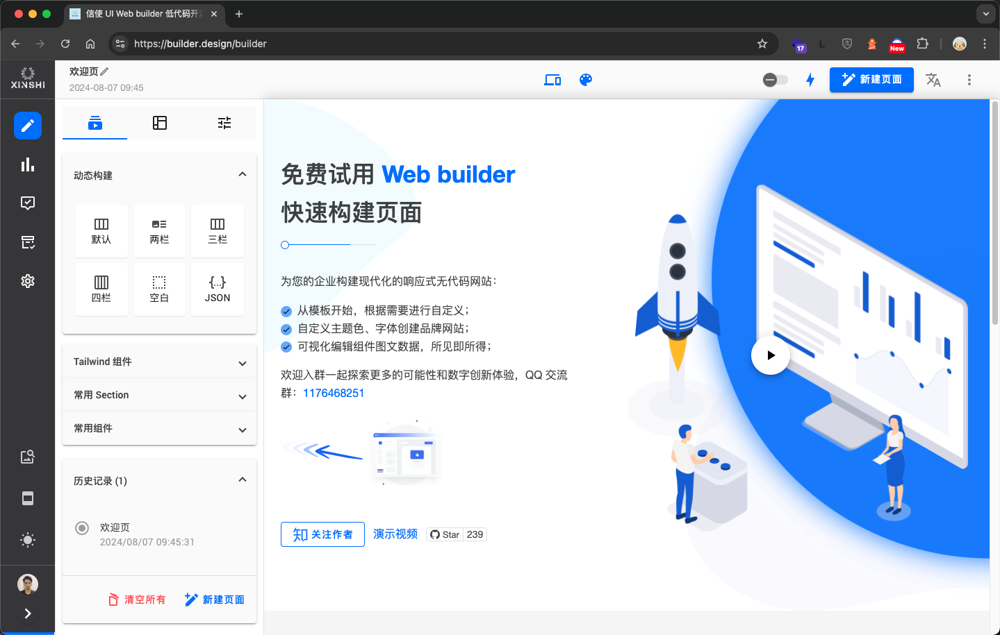

<h1 align="center">信使小程序框架</h1>

<p align="center">
  
  <br>
  <i>信使小程序是基于 Taro+NutUI 的小程序，Vue3拥有更好的编辑开发体验，<br>在 <a href="https://github.com/biaogebusy/web-builder"><strong>Web builder</strong></a>中通过拖拽可视化配置，小程序可动态构建页面。
    </i>
  <br>
</p>

<p align="center">
  <a href="https://builder.design"><strong>https://builder.design</strong></a>
  <br>
</p>

<p align="center">
  <a href="https://builder.design/builder">Web Builder </a>
  ·
  <a href="https://github.com/biaogebusy/xinshi-mini">信使小程序</a>
  ·
  <a href="https://ui.builder.design"> UI Storybook </a>
  ·
  <a href="https://www.zhihu.com/people/biaogebusy"> 知乎 </a>
   ·
  <a href="./README-EN.md"> English</a>
  <br>
  <br>
</p>

<p align="center">
  
  <br>
   
  <br>
</p>

> 信使 Web builder 是基于 Material 的 Angular 低代码前端框架，丰富的组件库可提供优秀的数字创新体验，<br>通过拖拽可视化配置快速构建现代化响应式 UI、多主题、多语言的 Web 页面，包含美观的后台管理主题，拥有完整的前端解决方案。体验：https://builder.design

## 开发步骤

- 复制文件 project.private.config.sample.json 重命名为 project.private.config.json
- 修改变量 appid

## install packages

```bash
npm install
```

## development

```bash
npm run dev
```

## production

```bash
npm run build
```

## lint

```bash
npm run lint
```

## lint with --fix

```bash
npm run lint:fix
```

### 相关资源

- [Vue.js](https://cn.vuejs.org/guide/introduction.html)
- [NUTUI](https://nutui.jd.com/taro/vue/4x/#/zh-CN/guide/intro)
- [Taro api](https://taro-docs.jd.com/docs/apis/about/desc)
- [tailwindcss](https://tailwindcss.com)
- [windicss](https://windicss.org/guide)
- [微信小程序开发者官方文档](https://developers.weixin.qq.com/miniprogram/dev/framework/)

## 最后

- QQ 交流群：1176468251
- 如果觉得这个项目对您有所助益，请帮忙点个 star

[](https://star-history.com/#biaogebusy/xinshi-mini&Date)
